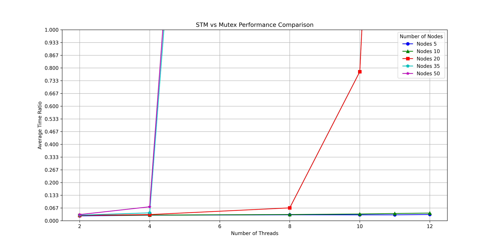
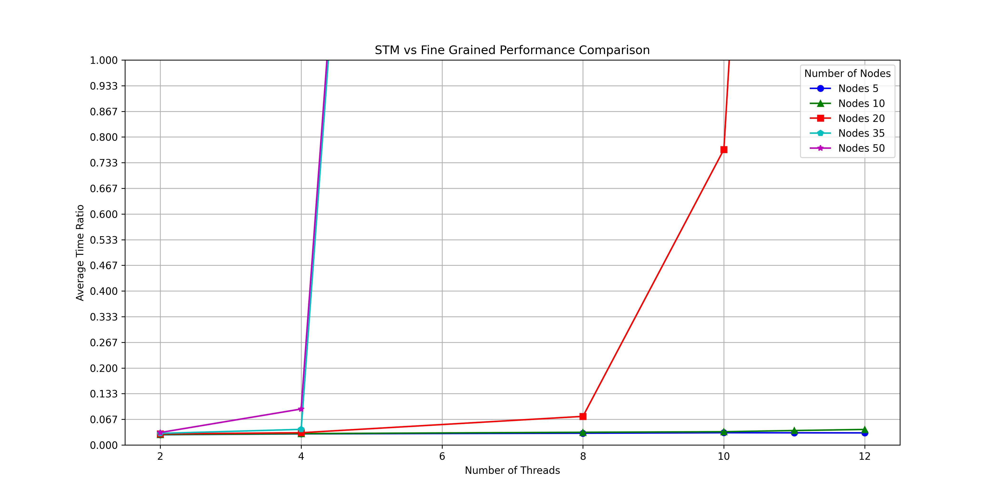

# A C++ Implementation of the Transactional Locking 2 Algorithm

**Course**: Independent Study (CSCI-799)  
**Author**: Anurag Choubey  
**Instructor**: Dr. Matthew Fluet  

## Description

This project aims to implement a software transactional memory library to facilitate the development of synchronized concurrent programs. Below is the directory structure of the project:

<pre>
src/
    gvc.h
    macro.h
    stats.h
    stmVar.h
    transaction.h
    custom_types/
        ll.h
tests/
    bank_test/
        bankFineGrained.cpp
        bankMutex.cpp
        bankSTM.cpp
        bankTime.sh
        bankAverage.sh
        compile.sh
        getStats.sh

    linked_list/
        llFineGrained.cpp
        llMutex.cpp
        llSTM.cpp
        llTime.sh
        llAverage.sh
        compile.sh
        getStats.sh
data/
    ll_data
    ll.csv
</pre>

The software transactional memory (STM) library developed in this project provides tools for developers to write safer concurrent applications, reducing the complexity associated with traditional lock-based synchronization methods.

The STM library ensures that memory transactions are executed with all-or-nothing semantics, improving the predictability and reliability of application behavior under concurrent execution.

## Features

- **Global Version Clock:** Implemented in `gvc.h` . This module defines a **thread-safe global version clock** using atomic operations from the C++ standard library. The implementation ensures atomic incrementation and retrieval of the version number, which is critical for validating the consistency of transactions correctly in concurrent programming environments. The `std::atomic<int64_t>` type is utilized to manage the clock's state securely, initialized at zero.

- **Macro Utilities:** Found in `macro.h`, these simplify the usage of complex STM operations.This header provides macros to simplify the management of transactions within software transactional memory (STM) systems. It includes `START_TX` and `END_TX` macros to initiate and conclude transactions, encapsulating error handling and repetitive transaction logic. The macros use the `Transaction` class to manage transaction details.
- **STM Variables:** Implemented with `stmVar.h`. `STM_VARIABLE_H` outlines the interface (`StmVariableBase`) and implementation (`StmVariable<T>`) for variables in a software transactional memory (STM) system. It facilitates lock management, value storage, and concurrency control utilizing modern C++ features like `std::any` for type-safe storage and `std::recursive_timed_mutex` for timed lock management. These classes ensure that STM variables can be locked, unlocked, and their states managed safely across multiple threads. `StmVariable<T>` extends `StmVariableBase` to provide type-specific storage and lock version management.

- **Transactions:** Managed with `transaction.h`, allowing variables to be read and written transactionally. This header file defines the `Transaction` class essential for managing the lifecycle of transactions within software transactional memory systems. It facilitates start, execution, and completion of transactions with concurrency control, using read-write logs to handle data consistency. The class includes methods to commit changes, rollback on errors, and manage transaction states.

- **Performance Statistics:** Captured via `stats.h` to analyze transaction performance. It defines the `Statistics` class to track transaction-related activities such as aborts, initializations, and restarts either for a single transaction or across multiple transactions.

- **Custom Data Types:** Such as linked lists in `custom_types/ll.h`, which are used to demonstrate STM operations in a practical context.

## Test Suites for Transactional Memory System

### Bank Simulation Tests

#### Location
- `tests/bank_test/`

#### Purpose
These tests simulate banking operations such as account transfers and balance checks using different synchronization mechanisms to manage concurrency. This suite is essential for validating the robustness and efficiency of the transactional memory system in handling real-world-like scenarios.

#### Components Tested
- `bankFineGrained.cpp`: Implements fine-grained locking.
- `bankMutex.cpp`: Utilizes mutexes for synchronization.
- `bankSTM.cpp`: Uses software transactional memory.

#### Utility Scripts
- `compile.sh`: Compiles the test programs.
- `bankTime.sh` and `bankAverage.sh`: Measure execution time and compute averages for performance comparison.
- `getStats.sh`: Gathers and displays statistics from test executions.

### Linked List Tests

#### Location
- `tests/linked_list/`

#### Purpose
Focuses on performing concurrent operations on linked lists, which are used to verify the locking and transaction mechanisms. These tests are crucial for ensuring that basic data structures operate correctly under the transactional memory system. The integrity of linked list structures after being modified by multiple transactions could form the basis of implementing more advanced algorithms based on trees and graphs, which are also pointer based structures.

#### Components Tested
- `llFineGrained.cpp`: Tests fine-grained locking mechanisms.
- `llMutex.cpp`: Tests mutex-based synchronization strategies.
- `llSTM.cpp`: Tests the integration and functionality of software transactional memory.

#### Utility Scripts
- `compile.sh`: Builds the linked list test executables.
- `llTime.sh` and `llAverage.sh`: Used for performance measurement and comparative analysis.
- `getStats.sh`: Collects performance metrics.

## Test Results

### Overview
Our testing methodology is designed to evaluate the performance and correctness of the transactional memory system under various conditions. The performance is measured in terms of execution time.

### Testing Approach

1. **Automated Test Scripts:** Each test suite utilizes automated scripts (`compile.sh`, `bankTime.sh`, `bankAverage.sh`, `llTime.sh`, `llAverage.sh`) to build the test cases, execute them, and measure their performance. 
   
2. **Concurrency Scenarios:** Multiple levels of concurrency are tested by varying the number of threads (`NUM_THREADS`) and operations (`NUM_NODES_PER_THREAD` or `NUM_LOOPS`) to simulate different load conditions on the system.

3. **Performance Metrics:** We focus on several key performance metrics:
    - **Execution Time:** Measures how long each test scenario takes, providing insights into the efficiency of our concurrency control mechanisms.
    - **Correctness:** This is not handled by the test scripts and is instead tested by the test code itself. Ensures that all transactions are processed correctly.

 Results from multiple runs are collected and analyzed.

### Result Compilation

#### Linked List Tests

    

 

    

 

##### Interpretation

- For both STMvs.Mutex and STMvs.FineGrained, we see that when the size of input to each thread is <=10, the ratio of time(STM)/time(Mutex) << 1.0, which means our STM implementation outperforms the standard global lock based implementation by an order of magnitude. 
For an input size of 20 nodes per thread, we see that our implementation outperforms the Mutex implementation for upto 10 threads, after which our implementation starts to underperform. 
We saw that for any number of threads greater than 10 and for input sizes greater than 15, there is a high amount of contention which causes a high number of transaction aborts and restarts. This causes an impedance in the forward progress and hence slows down our STM.

#### Bank Transfer Tests

- Unfortunately, our STM performs poorly in the bank transfer tests, with each test case timing out almost everytime across multiple runs. Even on the cases where the test script does not timeout, our implementation is slower than the global lock and fine-grained lock implementation by a factor ranging between [1,4].

#### Aborts and Restarts

- We observe that for both the linked list as well as bank test cases, the number of aborts and subsequent restarts increases non-linearly if either the number of threads or the size of the input data is increased. This implies high contention. Below is a run of our STM based linked list program tested on 12 threads with different input sizes.

    

 

- It is important to note that the last command did not terminate even after 8 minutes.

## Conclusion

Our implementation outperforms standard locking mechanisms when the size of inputs and total number of threads is low. The performance degenerates when either of the two parameters is increased beyond a particular threshold. Nevertheless, it points us in the direction of exploring more time efficient algorithms for STM implementation as well as algorithms for either reducing transaction rollbacks or guaranteeing their forward progress. 

## References
- Shavit, N., Touitou, D. Software transactional memory. Distrib Comput 10, 99–116 (1997). https://doi.org/10.1007/s004460050028
- Dice, D., Shalev, O., Shavit, N. (2006). Transactional Locking II. In: Dolev, S. (eds) Distributed Computing. DISC 2006. Lecture Notes in Computer Science, vol 4167. Springer, Berlin, Heidelberg. https://doi.org/10.1007/11864219_14
- Maurice Herlihy, Victor Luchangco, Mark Moir, and William N. Scherer. 2003. Software transactional memory for dynamic-sized data structures. In Proceedings of the twenty-second annual symposium on Principles of distributed computing (PODC '03). Association for Computing Machinery, New York, NY, USA, 92–101. https://doi.org/10.1145/872035.872048
- Tim Harris, James Larus, and Ravi Rajwar. 2010. Transactional Memory, 2nd Edition (2nd. ed.). Morgan and Claypool Publishers.